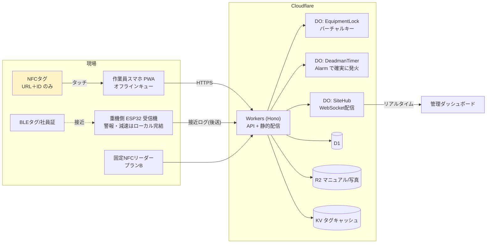

# Intent-Trace

空間・設備・安全の統合マネジメントプラットフォーム（合同会社Straid）

NFC（意図・ゼロ距離の証明）と BLE（空間・接近の検知）を組み合わせ、巡回・点検の確実な記録、設備カルテ、資格に基づく操作権限、手順インターロック、単独作業の生存確認、重機接近のヒヤリハット分析を一つのプロダクトで提供します。クラウド側は Cloudflare のエッジに完全集約しています。

## アーキテクチャ



| 企画書の要素 | 実装 |
|---|---|
| フロントエンド (Pages) | **Workers Static Assets**（Pages の後継。API と同一 Worker・同一オリジンで配信） |
| API (Workers) | `worker/` — Hono。タップ判定、資格判定、打刻、ヒヤリハット受信 |
| リアルタイム排他制御 (DO) | `EquipmentLock`（誰が操作中か）、`DeadmanTimer`（残り時間・Alarm）、`SiteHub`（WebSocket 配信） |
| D1 | 従業員・資格・設備・タグ・点検・巡回・ヒヤリハット・監査ログ（`migrations/`） |
| R2 | マニュアルPDF・点検写真（Worker 経由で認可付き配信） |
| KV | タグ定義のエッジキャッシュ、ログイン試行のレート制限 |
| 物理安全層 | `firmware/forklift-receiver/`（ESP32 リファレンス。通信断でも警報は動作） |

## 「NFC の仮想ビーコン化」の実装ポイント

- タグには `https://<host>/t/<tagId>` の **URL だけ** を書き込みます。iPhone / Android ともアプリ不要でタッチ → PWA が開き打刻されます。
- 状態（巡回の進捗、手順の段階、デッドマンの期限、設備の占有者）はすべてクラウド側。1 回のタッチが文脈に応じて「巡回の地点通過」「手順ステップの完了」「生存応答」「設備カルテの呼び出し」に解釈されます（`worker/lib/tap.ts`）。
- **証明レベル** をタップごとに記録します。
  - `high` … NTAG 424 DNA の SUN（タッチごとに生成される暗号署名付きURL）を検証済み／固定リーダー
  - `medium` … Android のアプリ内スキャンで物理UIDを照合
  - `low` … 静的URLのみ（URLを知っていれば再現可能）
- SUN はカウンタの単調増加と一意制約でリプレイ（撮影したURLでの不正打刻）を拒否します（`worker/lib/sun.ts`、NXP AN12196 のテストベクタで検証済み）。
- 点検記録は「完了時刻の30分以内に本人がその設備タグへタッチしていること」を要求し、バーチャルキーは「5分以内のタッチ＋有効な資格」を要求します。

## 機能一覧

**作業員 PWA**（`/`）: タグ着地ページ、設備カルテ（PDFマニュアル・履歴）、点検チェックリスト＋写真、巡回（順序強制可）、バーチャルキー、手順インターロック、単独作業の生存確認、ヒヤリハット報告、Android のアプリ内NFCスキャン、オフライン保存と自動再送。

**管理ダッシュボード**（`/admin`）: リアルタイムフィード、未対応アラート、単独作業者の残り時間、設備の使用状況、日別推移、ゾーン別ヒートマップ・曜日×時間帯・作業員別・重機別（Pro）、点検所要時間分析（Pro）、月次報告書（印刷/PDF）、CSV出力、設備・タグ・ユーザー・資格・巡回・手順・IoTデバイス・現場/ゾーン管理、監査ログ。

**デバイス API**（`/api/device/*`, `Authorization: Device <id>.<token>`）: BLE接近ログのバッチ受信、起動許可（ignition）状態、固定リーダーでの社員証タッチ（プランB）。

## 画面構成（3層）

| 画面 | URL | 利用者 | 主な機能 |
|---|---|---|---|
| 運営コンソール | `/ops` | 合同会社Straid（オーナー / スタッフ） | テナント作成・契約管理・利用停止、代理ログイン、NFCタグ在庫（発行→UID取込→出荷割当）、請求書発行・入金管理、料金プラン、お知らせ配信、サポート対応、運営監査ログ |
| テナント管理画面 | `/admin` | 契約企業の管理者・マネージャー | ダッシュボード、分析、記録・レポート、設備カルテ、**受領タグの登録・交換**、巡回・手順、作業員・資格・社員証、IoTデバイス、現場・ゾーン、契約・請求書・お問い合わせ・パスワード |
| 現場アプリ（PWA） | `/` | 作業員 | タッチ記録、点検、巡回、手順、生存確認、ヒヤリハット |

初回は `/ops/login` でセットアップトークンを入力して運営オーナーを作成します。

### NFCタグのライフサイクル

1. **発行**（運営）: 登録コード（=タグURLのID）を採番。NTAG 424 DNA はタグ固有の暗号鍵も生成
2. **書き込み**（運営/業者）: CSV（NTAG424は鍵付きCSV・オーナーのみ）でURLを書き込み、ラベル印刷シートを貼付
3. **UID取込**（運営）: 書き込みツールの出力（登録コード, UID）を取り込み
4. **出荷割当**（運営）: テナントに割り当て（送り状番号などをメモ）
5. **現地登録**（テナント）: 貼った場所で管理者がスマホをタッチ → その場で用途・呼び名・設備を登録。管理画面で登録コード入力でも可
6. **交換**（テナント）: 破損・紛失時は新しいタグに交換。巡回ルート・手順・固定リーダーの紐付けは自動で引き継ぎ
7. **社員証**: 出荷された社員証は「作業員・資格」でユーザーに割り当て（固定リーダーでの認証に使用）

プランごとの上限（タグ・ユーザー・現場）と機能（分析・IoT・レポート・暗号鍵の手動登録）は運営コンソールの「料金プラン」で設定し、テナント個別に上限を上書きできます。

## ローカル開発

```bash
npm install
cp .dev.vars.example .dev.vars          # 値を設定
npm run db:migrate:local
npm run dev                              # http://localhost:5173
# 別ターミナルでデモデータ投入（30日分の擬似履歴つき）
node scripts/seed-demo.mjs http://localhost:5173 <SETUP_TOKEN> --history
npx wrangler d1 execute intent-trace --local --file=seed/history.sql
```

デモアカウント: 管理者 `admin@demo.example / demo-admin-pass`、作業員 会社コード `DEMO` / 社員番号 `W001`〜`W003` / PIN `1234`

テスト:

```bash
npm test                                  # 単体（AES-CMAC / SUN）
node scripts/e2e.mjs http://localhost:5173  # 結合（seed 後）
```

## デプロイ（Cloudflare）

**GitHub Actions（標準）**: リポジトリの Secrets に `CLOUDFLARE_API_TOKEN`（任意で `CLOUDFLARE_ACCOUNT_ID`）を登録すると、`main` への push ごとに `scripts/ci-deploy.sh` が以下を冪等に実行します。

- D1 / KV / R2 がなければ作成し、ID を `wrangler.jsonc` に差し込んでビルド
- D1 マイグレーション → デプロイ → Worker シークレット（`JWT_SECRET` / `TAG_KEY_SECRET`）の初回生成
- 初回のみ `SETUP_TOKEN` を生成してデモテナントを作成し、認証情報を `deploy/operator.pub.pem` の公開鍵で暗号化してログに出力（公開リポジトリでも平文は残りません。対応する秘密鍵は運営者のみが保持）

**手元から（代替）**: `CLOUDFLARE_API_TOKEN` / `CLOUDFLARE_ACCOUNT_ID` を設定して `./scripts/provision.sh`。

テナント追加:
   ```bash
   curl -X POST https://<host>/api/auth/setup -H 'content-type: application/json' \
     -d '{"token":"<SETUP_TOKEN>","orgName":"株式会社○○","orgCode":"ABC","siteName":"本社ビル","adminName":"山田","email":"...","password":"..."}'
   ```

## NTAG 424 DNA の設定（暗号タグ）

NXP TagXplorer 等で NDEF ファイルに URL `https://<host>/t/<tagId>?picc=<32桁>&cmac=<16桁>` を書き込み、SDM を以下で有効化します。

- UID ミラー・読取カウンタミラー: 有効（PICCData を暗号化 = SDMMetaRead に鍵を割当）
- PICCDataOffset: `picc=` の値の先頭、SDMMACOffset / SDMMACInputOffset: `cmac=` の値の先頭（MAC 入力は空）
- 管理画面でタグ登録時に SDMMetaReadKey / SDMFileReadKey と UID を入力（鍵は `TAG_KEY_SECRET` で AES-GCM 暗号化して D1 に保存）
- タグごとに固有鍵を使用してください（デモの全ゼロ鍵は NXP の公開テストベクタ用）

## 既知の制約・今後

- iPhone の Safari は Web NFC 非対応のため、iPhone では URL 方式（証明レベルは static タグで `low`、SUN タグで `high`）。
- ブラウザ（PWA）からは BLE 発信ができないため、接近検知は携帯 BLE タグ＋重機側受信機の構成。
- 集計は JST 固定（サイト別タイムゾーンは未対応）。
- 通知（メール/LINE/プッシュ）連携、元請けへの自動レポート送付、オンライン決済（カード・口座振替）は未実装（請求書発行・入金消込は運営コンソールで手動）。
- ファームウェアはリファレンス（未コンパイル・未実機検証）。車両制動との連動は機能安全評価が前提（フェーズ3）。
